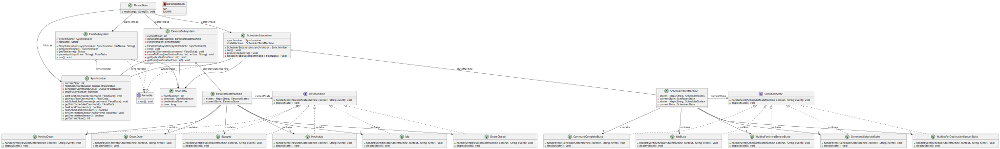

# SYSC3303Project - Elevator Control System

## Description
Iteration_1 of SYSC3303 for Group 8.  
Based off Assignment_1, the current iteration models the operation of an elevator, handling floor requests, moving between floors, and scheduling these tasks using the 3 Subsystems outlined in the Project Specification orchestrated by the Java Monitor `Synchronizer.java` class.

## Installation
To import the project into IntelliJ IDEA from VCS:

1. Open IntelliJ IDEA and select **"Get from Version Control"** on the welcome screen.
2. In the URL field, enter `https://github.com/Zhangjason308/SYSC3303Project.git`.
3. Choose the directory where you want to clone the project and click **"Clone"**.
4. Once cloned, IntelliJ IDEA may NOT automatically set up everything needed to run the project.
   To run the unit tests for the `U_Test` class:
   Add 'JUnit5.8.1' to class path via 💡ContextActions
5. Ensure Java SDK 21.0.1 is set up in the project structure. This project is developed with Java 21 but should be compatible with most Java versions.

## Project Structure
- `DirectionEnum.java`: Defines elevator movement directions.
- `ElevatorSubsystem.java`: Simulates elevator operations.
- `FloorData.java`: Data model for floor requests.
- `FloorSubsystem.java`: Manages floor request inputs.
- `SchedulerSubsystem.java`: Schedules elevator movements.
- `Synchronizer.java`: Coordinates communications between subsystems.
- `ThreadMain.java`: Entry point, initializes subsystems.
- `ElevatorEvents.csv`: Input file for floor subsystem.

## UML Class Diagram Iteration 2

## UML Sequence Diagram Iteration 2

## Sample Output
Elevator is moving to floor 1 to pickup passenger  
Elevator has arrived at floor 1  
Elevator is moving to floor 4  
Elevator has arrived at floor 4, passengers have been dropped off  
Elevator is moving to floor 2 to pickup passenger  
Elevator has arrived at floor 2  
Elevator is moving to floor 4  
Elevator has arrived at floor 4, passengers have been dropped off  
Elevator is moving to floor 3 to pickup passenger  
Elevator has arrived at floor 3  
Elevator is moving to floor 4  
Elevator has arrived at floor 4, passengers have been dropped off

## Unit Testing Instructions
To run the unit tests for the `U_Test` class:
Add 'JUnit5.8.1' to class path via 💡ContextActions

### Using IntelliJ IDEA
1. Navigate to the `src/test/java/SYSC3303Project/Test` directory in the Project view.
2. Right-click on the `U_Test` class and select **Run 'U_Test'**.
3. IntelliJ IDEA will execute all the unit tests in the `U_Test` class, and you can view the results in the Run window.

## Contributions
- **Jason Zhang 101191526**
  - `DirectionEnum.java`
  - `ElevatorSubsystem.java`
  - `FloorData.java`
  - `FloorSubsystem.java`
  - `SchedulerSubsystem.java`
  - `Synchronizer.java`

- **Caleb Lui-Yee 101187217**
  - `ThreadMain.java`

- **HaoChen Hou 101077553**
  - Unit Testing

- **Yahya Khan 101073911**
  - UML Class Diagram
  - UML Sequence Diagram
  - Readme.txt

- **Bakri Al Rajab 10116420**
  - Unit Testing
