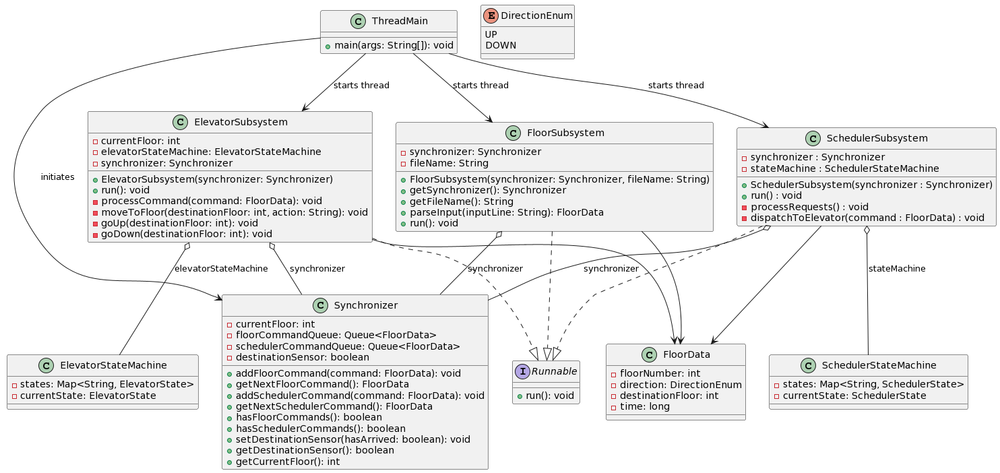
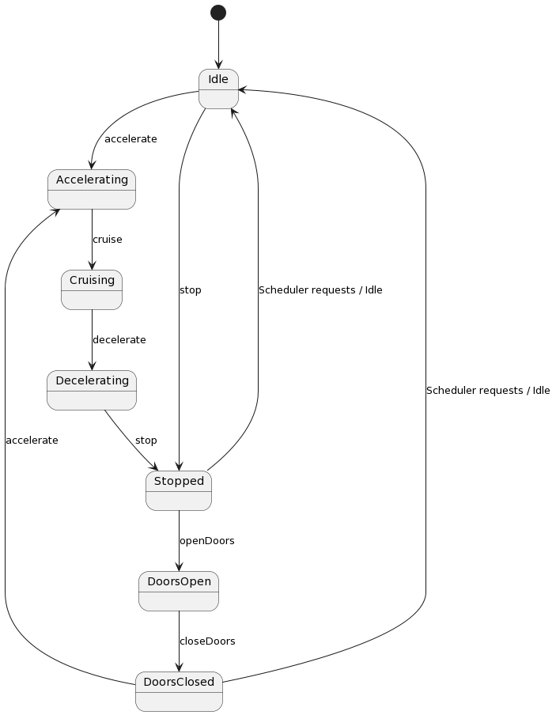

# SYSC3303Project - Elevator Control System

## Description
Iteration_4 of SYSC3303 for Group 8.  
Building off of Iteration I, Scheduler and Elevator Subsystems now have state machines. Project was heavily refactored in this Iteration.

## Installation
To import the project into IntelliJ IDEA from VCS:

1. Open IntelliJ IDEA and select **"Get from Version Control"** on the welcome screen.
2. In the URL field, enter `https://github.com/Zhangjason308/SYSC3303Project.git`.
3. Choose the directory where you want to clone the project and click **"Clone"**.
4. Once cloned, IntelliJ IDEA may NOT automatically set up everything needed to run the project.
   To run the unit tests for the `U_Test` class:
   Add 'JUnit5.8.1' to class path via 💡ContextActions
5. Ensure Java SDK 21.0.1 is set up in the project structure. This project is developed with Java 21 but should be compatible with most Java versions.

# Project Structure

## Documentation
- **Iteration_4**: Contains documentation and resources for iteration 4.

## Elevator
- **StateMachine**: Contains the elevator state machine related classes.
  - **States**
    - `DoorsClosedState.java`: Handles the state of the elevator when the doors are closed.
    - `DoorsOpenState.java`: Manages the state of the elevator when the doors are open.
    - `ElevatorState.java`: Interface for the different states of the elevator.
    - `IdleState.java`: Represents the elevator's idle state.
    - `MovingDownState.java`: Manages the elevator moving downwards.
    - `MovingUpState.java`: Manages the elevator moving upwards.
    - `StoppedState.java`: Represents the elevator when it is stopped.
  - `ElevatorStateMachine.java`: Manages state transitions of the elevator.
- `ElevatorSubsystem.java`: Simulates the overall operation of the elevator.

##Floor
  - `FloorData.java`: Data model representing the floor requests.
  - `FloorSubsystem.java`: Handles floor request inputs and processing.

## Scheduler
- **StateMachine**: Contains the scheduler state machine related classes.
  - **States**: Defines the possible states of the scheduler and their behavior.
    - `CommandCompleteState.java`: State after a command has been executed.
    - `CommandSelectedState.java`: State when a command is selected.
    - `IdleState.java`: The idle state of the scheduler.
    - `SchedulerState.java`: Interface for the states of the scheduler.
    - `WaitingForArrivalSensorState.java`: State during waiting for arrival sensor signal.
    - `WaitingForDestinationSensorState.java`: State during waiting for destination arrival sensor signal.
  - `SchedulerStateMachine.java`: Manages the transitions between scheduler states.
  - `SchedulerSubsystem.java`: Coordinates the scheduling of elevator movements.

## Test
- `Test_1.csv`: Test data set for the first test scenario.
- `Test_2.csv`: Test data set for the second test scenario.
- `U_Test.java`: Unit test suite for the system.

## Core
- `DirectionEnum.java`: Enumeration that defines the elevator's possible directions.
- `ElevatorEvents.csv`: CSV file containing a list of elevator events for simulation.
- `README.md`: The main documentation file providing an overview of the project.
- `Synchronizer.java`: Synchronizes communication between various subsystems.
- `ThreadMain.java`: The main class that launches the system and initializes all subsystems.

## UML MASTER Class Diagram Iteration 4 (Zoom in)

## UML CORE Class Diagram Iteration 4 
.

## State Diagram Elevator - Iteration 4 
.

## State Diagram Scheduler - Iteration 4 
.

## Floor UML Class Diagram
.

## Floor UML Sequence Diagram
.

## Scheduler UML Class Diagram
.

## Scheduler UML Sequence Diagram
.

## Timing Diagram 1
.

## Timing Diagram 2
.

## Sample Output

## Unit Testing Instructions
To run the unit tests for the `U_Test` class:
Add 'JUnit5.8.1' to class path via 💡ContextActions

### Using IntelliJ IDEA
1. Navigate to the `src/test/java/SYSC3303Project/Test` directory in the Project view.
2. Right-click on the `U_Test` class and select **Run 'U_Test'**.
3. IntelliJ IDEA will execute all the unit tests in the `U_Test` class, and you can view the results in the Run window.

## Iteration 4 Contributions
- **Jason Zhang 101191526**
  - Updated UML Class Diagrams.
  - Refactored System Output.
  - Enhanced JavaDocs.
  - Developed State Diagrams.
  - Refactored State Machines.

- **Caleb Lui-Yee 101187217**
  - Developed State Diagrams.
  - Initial State Machine Development.
  - Refactored State Machines alongside Jason Zhang.

- **HaoChen Hou 101077553**
  - Unit Testing.
  - Test Cases Development alongside Bakri.

- **Yahya Khan 101073911**
  - Refactored Elevator Subsystem alongside Jason Zhang and Caleb Lui-Yee.
  - Refactored Scheduler Subsystem alongside Jason Zhang and Caleb Lui-Yee.
  - Refactored Floor Subsystem alongside Jason Zhang and Caleb Lui-Yee.
  - Refactored Synchronizer.
  - Updated UML Sequence Diagram.
  - Updated UML Class Diagrams.
  - Refactored State Machines alongside Jason Zhang and Caleb Lui-Yee.
  - Updated Readme.
  - Documentation for the entire system.
